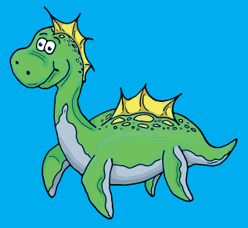

# BioGeocaching Find Lunzi

**Author**: [WasserCluster Lunz](https://wcl.ac.at/en/outreach/find-lunzi-biogeocaching)

Discover the treasures of nature and learn about the work of researchers as you search for *Lunzi*



## How to find Lunzi?

## Questions per Station
1. [Question](./questions/question_1.md)
2. Question


## Answer per Station

| Station | Answer |
|---------|--------|
| 1       | `3+1=4`|


## Additional Information

```
gps_lat =
gps_lon =
```

$$ \frac{a}{b}={c} $$


## References 
- [Markdown Table Generator](https://www.tablesgenerator.com/markdown_tables#google_vignette)
- [WasserCluster Lunz](https://wcl.ac.at/en/)
- [Markdown Cheat Sheet](https://www.markdownguide.org/cheat-sheet/)
